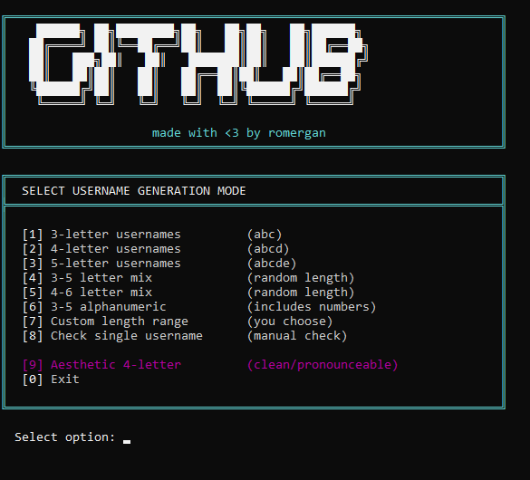

<div align="center">

# 🚀 GitHub Username Checker


<p align="center">
  A lightning-fast, multi-threaded tool to find available GitHub usernames.<br>
  Features a unique <b>Aesthetic Mode</b> for finding clean, pronounceable 4-letter handles.
</p>



[Report Bug](https://github.com/fauq/github-username-checker/issues) · [Request Feature](https://github.com/fauq/github-username-checker/issues)

</div>

---

## ✨ Features

* **⚡ Multi-Threaded:** Checks multiple usernames simultaneously for maximum speed.
* **🎨 Aesthetic Mode:** The only checker with a smart algorithm to generate clean, pronounceable 4-letter names (like `miko`, `kaia`, `joon`) instead of random gibberish.
* **🛡️ Profile Verification:** Checks directly against profile pages (404 status) to detect reserved or banned usernames that API-only checkers often miss.
* **🧠 Smart Limits:** Automatically handles GitHub rate limits (429 errors) with a cool-down timer.
* **💾 Auto-Save:** Instantly saves valid usernames to `available_usernames.txt`.

## ⚠️ Accuracy & Disclaimer

> **Note regarding accuracy:** This tool is approximately **97% accurate**. However, please be aware that on rare occasions, the checker might report a username as available when it is actually reserved or banned by GitHub's internal systems.

**Please use this tool responsibly.**
Checking thousands of usernames in a short period may result in your IP address being temporarily rate-limited by GitHub. This tool includes delays to help prevent this, but use at your own risk.

## 📦 Installation

1.  **Clone the repository:**
    ```bash
    git clone [https://github.com/fauq/github-username-checker.git](https://github.com/fauq/github-username-checker.git)
    cd github-username-checker
    ```

2.  **Install dependencies:**
    ```bash
    pip install requests
    ```

3.  **Run the tool:**
    ```bash
    python github_checker.py
    ```

## 🎮 Usage Modes

Once launched, use the interactive menu to select your generation mode:

| Option | Mode | Description |
| :--- | :--- | :--- |
| **[1-3]** | **Fixed Length** | Generates random 3, 4, or 5 letter names (e.g., `xkq`, `abcd`). |
| **[4-6]** | **Mixed/Alpha** | Generates mixed lengths or alphanumeric names (including numbers). |
| **[9]** | **Aesthetic** | **(Recommended)** Generates "clean" 4-letter names using CVCV patterns. |
| **[7]** | **Custom** | You choose the minimum and maximum character length. |
| **[8]** | **Single Check** | Manually check one specific username. |

## 🤝 Contributing

Contributions, issues, and feature requests are welcome! Feel free to check the [issues page](https://github.com/fauq/github-username-checker/issues).

## 📜 License

Distributed under the MIT License. See `LICENSE` for more information.

<div align="center">
  <br>
  <sub>Made with <3 by <b>romergan</b></sub>
</div>
